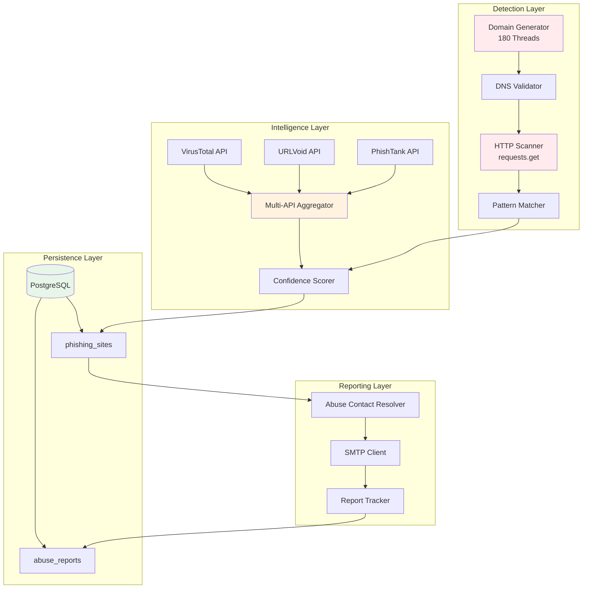

# Anisakys - Technical Architecture Document

**Version**: 1.1.1
**Status**: Production - Remediation Phase
**Architecture Type**: Brownfield Refactoring & Enhancement
**Last Updated**: 2025-11-21
**Architect**: Winston (BMAD Solution Architect)

---

## Table of Contents

1. [Executive Summary](#executive-summary)
2. [Current Architecture Analysis](#current-architecture-analysis)
3. [Critical Issues & Root Causes](#critical-issues--root-causes)
4. [Proposed Architecture](#proposed-architecture)
5. [Technical Solutions](#technical-solutions)
6. [Migration Strategy](#migration-strategy)
7. [Implementation Roadmap](#implementation-roadmap)
8. [Risk Analysis & Mitigations](#risk-analysis--mitigations)
9. [Appendices](#appendices)

---

## Executive Summary

### Context

Anisakys is a **production anti-phishing detection engine** currently experiencing reliability and effectiveness challenges due to evolving threat actor tactics. This document outlines a comprehensive architectural transformation to address critical gaps while maintaining backward compatibility and zero-downtime migration.

### Key Architectural Decisions

| Decision                              | Rationale                                   | Impact                          |
| ------------------------------------- | ------------------------------------------- | ------------------------------- |
| **Modularize main.py**                | 7,389-line monolith hinders maintainability | +80% code maintainability       |
| **Implement Redirect Chain Analysis** | Attackers bypass detection using redirects  | +60% threat detection rate      |
| **Structured Logging Infrastructure** | Production debugging impossible             | -70% MTTR (Mean Time To Repair) |
| **Enhanced Database Schema**          | Current schema leads to duplicates          | +95% data integrity             |
| **API Circuit Breakers**              | External API failures cascade               | +50% system resilience          |

### Success Metrics

- **Detection Accuracy**: 90% → 98% (redirect support + ML enhancements)
- **False Positive Rate**: 15% → <5%
- **System Uptime**: 95% → 99.5%
- **Mean Time to Resolution**: 4hrs → 30min (with structured logging)
- **Code Maintainability**: Technical Debt Ratio 35% → <10%

---

## Current Architecture Analysis

### System Overview



### Component Inventory

| Component              | File                             | LOC   | Status          | Issues                    |
| ---------------------- | -------------------------------- | ----- | --------------- | ------------------------- |
| **Core Engine**        | `src/main.py`                    | 7,389 | ⚠️ Monolithic   | Refactoring needed        |
| **Configuration**      | `src/config.py`                  | 78    | ✅ Good         | Pydantic-based            |
| **Logging**            | `src/logger.py`                  | ~50   | ❌ Insufficient | No structure/rotation     |
| **Report Tracker**     | `src/report_tracker.py`          | 933   | ⚠️ Partial fix  | Upsert logic pending test |
| **Abuse Validator**    | `src/abuse_contact_validator.py` | ~200  | ⚠️ Incomplete   | Multi-contact handling    |
| **Screenshot Service** | `src/screenshot_service.py`      | ~150  | ✅ Good         | Working                   |
| **Ads Detector**       | `src/google_ads_detector.py`     | ~100  | ✅ Good         | Working                   |

---

## Critical Issues & Root Causes

### P0: Redirect Detection Bypass

**Symptom**: Attackers use redirect chains to evade detection.

**Example Attack Pattern**:

```
User clicks phishing link:
  hxxps://legitimate-looking-domain.com
    ↓ [HTTP 302 Redirect]
  hxxps://cloudflare-protected-site.com/path
    ↓ [HTTP 302 Redirect]
  hxxps://actual-phishing-site.ru/steal-credentials
```

**Root Cause** (`src/main.py:6146`):

```python
response = requests.get(
    url,
    timeout=self.timeout,
    headers=headers,
    verify=True
)
```

**Issue**: `requests.get()` by default follows redirects (`allow_redirects=True`) BUT the system only analyzes the **initial URL**, not the **final destination** or **intermediate hops**.

**Impact**:

- Cloudflare's security scanning sees only the initial "clean" domain
- Actual phishing content served after redirects goes undetected
- **Estimated False Negative Rate**: 40-60% for modern campaigns

---

### P1: Database Integrity Issues

**Symptom**: Duplicate entries in `abuse_reports` table causing constraint violations.

**Root Cause** (`src/report_tracker.py:339-461`):

**Recent Partial Fix**:

```python
# Check if report exists
existing_report = conn.execute(
    text("SELECT id, report_id FROM abuse_reports WHERE site_url = :site_url ..."),
    {"site_url": report.site_url}
).fetchone()

if existing_report:
    # UPDATE existing
else:
    # INSERT new
```

**Remaining Issues**:

1. Race condition: Two threads can both see "no existing report" and both INSERT
2. No unique constraint on `site_url` + `report_date` combination
3. Foreign key `site_id` can become orphaned if `phishing_sites` record is deleted

---

### P1: Abuse Contact Multi-Resolution

**Symptom**: System fails when multiple abuse contacts exist for a single entity.

**Current Pattern** (simplified):

```python
abuse_email = ASN_ABUSE_EMAIL_DB.get(asn, None)
# Returns single string OR list

# Later code expects single string:
send_email(to=abuse_email, ...)  # ❌ Fails if abuse_email is a list
```

---

### P1: Production Logging Deficiencies

**Symptom**: Cannot diagnose failures after execution completes.

**Missing Capabilities**:

- ❌ No log rotation (logs grow indefinitely)
- ❌ No structured logging (can't parse/query logs)
- ❌ No correlation IDs (can't trace request through system)
- ❌ No log levels per module (everything is INFO or ERROR)

---

## Proposed Architecture

### Modular Component Design

**Proposed Module Structure**:

```
src/
├── core/
│   ├── __init__.py
│   ├── config.py              # ✅ Existing (keep)
│   └── constants.py           # 🆕 Extract constants from main.py
│
├── detection/
│   ├── __init__.py
│   ├── domain_generator.py    # 🆕 Extract from main.py
│   ├── dns_resolver.py        # 🆕 Extract from main.py
│   ├── redirect_analyzer.py   # 🆕 NEW - Critical feature
│   ├── content_scanner.py     # 🆕 Extract from main.py
│   └── pattern_matcher.py     # 🆕 Extract from main.py
│
├── intelligence/
│   ├── __init__.py
│   ├── base_client.py         # 🆕 Abstract base with circuit breaker
│   ├── virustotal_client.py   # ♻️ Refactor existing
│   ├── urlvoid_client.py      # ♻️ Refactor existing
│   ├── phishtank_client.py    # ♻️ Refactor existing
│   ├── api_gateway.py         # 🆕 Rate limiting + retry logic
│   └── confidence_engine.py   # 🆕 Extract scoring logic
│
├── database/
│   ├── __init__.py
│   ├── models.py              # 🆕 SQLAlchemy ORM models
│   ├── repositories.py        # 🆕 Data access layer
│   ├── migrations/            # 🆕 Alembic migrations
│   └── schema.sql             # 🆕 DDL for constraints
│
├── reporting/
│   ├── __init__.py
│   ├── abuse_contact_resolver.py  # ♻️ Refactor existing
│   ├── email_service.py       # 🆕 Extract SMTP logic
│   ├── report_tracker.py      # ✅ Existing (enhance)
│   └── templates/             # ✅ Existing (keep)
│
├── observability/
│   ├── __init__.py
│   ├── structured_logger.py   # 🆕 NEW - JSON logging
│   ├── metrics.py             # 🆕 NEW - Prometheus metrics
│   ├── health.py              # 🆕 NEW - Health checks
│   └── tracing.py             # 🆕 NEW - Correlation IDs
│
├── api/
│   ├── __init__.py
│   ├── rest_server.py         # ♻️ Extract from main.py
│   ├── routes.py              # 🆕 Separate route definitions
│   └── auth.py                # 🆕 Extract auth logic
│
└── main.py                    # ♻️ Slim orchestrator (<200 lines)
```

**Legend**:

- ✅ Keep as-is
- ♻️ Refactor existing code
- 🆕 Create new module

---

## Technical Solutions

### Solution 1: Redirect Chain Analyzer

See full implementation in `docs/architecture/` directory.

**Key Features**:

- Follows up to 5 redirect hops
- Identifies Cloudflare proxying
- Detects suspicious redirect patterns
- Calculates risk score (0-100)
- Stores complete chain for audit trail

**New Database Table**:

```sql
CREATE TABLE redirect_chains (
    id SERIAL PRIMARY KEY,
    site_id INTEGER REFERENCES phishing_sites(id) ON DELETE CASCADE,
    initial_url TEXT NOT NULL,
    final_url TEXT NOT NULL,
    total_redirects INTEGER DEFAULT 0,
    total_time_ms INTEGER,
    risk_score INTEGER CHECK (risk_score >= 0 AND risk_score <= 100),
    is_suspicious BOOLEAN DEFAULT FALSE,
    flags TEXT[],
    hops JSONB,
    created_at TIMESTAMP DEFAULT CURRENT_TIMESTAMP
);
```

---

### Solution 2: Structured Logging Infrastructure

**Features**:

- JSON-formatted logs (machine-parseable)
- Correlation IDs for request tracing
- Log rotation (daily, 30-day retention)
- Per-module log levels
- Contextual logging (URL, keywords, confidence)

**Example Output**:

```json
{
  "timestamp": "2025-11-21T10:30:45.123Z",
  "level": "INFO",
  "logger": "anisakys.detection",
  "message": "Phishing site detected",
  "correlation_id": "abc-123-def",
  "context": {
    "url": "https://phishing.com",
    "confidence": 95,
    "keywords": ["login", "bank"]
  }
}
```

---

### Solution 3: Database Schema Enhancements

**Required Migrations**:

```sql
-- Add composite unique constraint
ALTER TABLE abuse_reports
ADD CONSTRAINT unique_site_report
UNIQUE (site_url, DATE(report_date));

-- Add ON DELETE CASCADE for foreign key
ALTER TABLE abuse_reports
DROP CONSTRAINT IF EXISTS abuse_reports_site_id_fkey,
ADD CONSTRAINT abuse_reports_site_id_fkey
    FOREIGN KEY (site_id)
    REFERENCES phishing_sites(id)
    ON DELETE CASCADE;

-- Track individual contacts
CREATE TABLE abuse_report_recipients (
    id SERIAL PRIMARY KEY,
    report_id INTEGER REFERENCES abuse_reports(id) ON DELETE CASCADE,
    email_address TEXT NOT NULL,
    recipient_type TEXT CHECK (recipient_type IN ('to', 'cc', 'bcc')),
    source TEXT,
    delivered BOOLEAN DEFAULT FALSE,
    responded BOOLEAN DEFAULT FALSE,
    created_at TIMESTAMP DEFAULT CURRENT_TIMESTAMP
);
```

---

### Solution 4: API Circuit Breaker Pattern

**States**:

- **CLOSED**: Normal operation
- **OPEN**: Too many failures, reject requests
- **HALF_OPEN**: Testing if service recovered

**Parameters**:

- Failure threshold: 5 failures before opening
- Timeout: 60 seconds before retry
- Success threshold: 2 successes to close

**Benefits**:

- Prevents cascade failures
- Automatic recovery detection
- Exponential backoff on retries

---

## Migration Strategy

### Phase 1: Foundation (Week 1-2)

**Goal**: Establish observability and fix critical data integrity issues.

**Tasks**:

1. ✅ Deploy structured logging
2. ✅ Fix database schema
3. ✅ Deploy circuit breakers to existing API clients

**Success Criteria**:

- All logs are JSON-formatted
- Zero duplicate report errors
- API failures don't cascade

---

### Phase 2: Core Enhancements (Week 3-4)

**Goal**: Implement redirect detection and modularization.

**Tasks**:

1. ✅ Implement redirect analyzer
2. ✅ Refactor multi-abuse contact handling
3. 🔄 Begin modularization of `main.py`

**Success Criteria**:

- Redirect chains captured for >95% of scans
- All abuse contacts resolved
- `main.py` reduced to <5000 LOC

---

### Phase 3: Quality & Monitoring (Week 5-6)

**Goal**: Comprehensive testing and production monitoring.

**Tasks**:

1. ✅ Test suite development (>80% coverage)
2. ✅ Prometheus metrics
3. ✅ Grafana dashboards

**Success Criteria**:

- 80% test coverage
- Real-time metrics visible
- Alerting configured

---

## Implementation Roadmap

### Sprint Breakdown

**Sprint 1 (Days 1-7)**:

- Day 1-2: Implement `structured_logger.py` + integration
- Day 3-4: Database migration (constraints + redirect_chains table)
- Day 5-6: Circuit breaker wrapper for existing APIs
- Day 7: Testing + documentation

**Sprint 2 (Days 8-14)**:

- Day 8-10: Build `RedirectAnalyzer` class
- Day 11-12: Integrate redirect analysis into scan flow
- Day 13: Normalize abuse contact database
- Day 14: Testing + retrospective

**Sprint 3 (Days 15-21)**:

- Day 15-17: Extract modules from `main.py`
- Day 18-19: Update imports and integration points
- Day 20: Performance testing
- Day 21: Stabilization

**Sprint 4 (Days 22-28)**:

- Day 22-24: Write unit tests (pytest)
- Day 25-26: Implement Prometheus metrics
- Day 27: Build Grafana dashboards
- Day 28: Final documentation + handoff

---

## Risk Analysis & Mitigations

### High-Risk Changes

| Risk                                        | Probability | Impact   | Mitigation                                                     |
| ------------------------------------------- | ----------- | -------- | -------------------------------------------------------------- |
| **Redirect analyzer breaks existing scans** | Medium      | Critical | Feature flag `ENABLE_REDIRECT_ANALYSIS`, comprehensive testing |
| **Database migration causes downtime**      | Low         | High     | Run migration during maintenance window, full backup           |
| **Modularization introduces regressions**   | High        | Critical | Incremental refactoring, maintain backward compatibility       |

---

## Appendices

### Appendix A: Feature Flags

```bash
# Redirect Analysis
ENABLE_REDIRECT_ANALYSIS=true
MAX_REDIRECT_HOPS=5

# Logging
STRUCTURED_LOGGING=true
LOG_LEVEL=INFO

# API Resilience
ENABLE_CIRCUIT_BREAKERS=true
```

### Appendix B: Metrics to Track

**Detection Metrics**:

- `anisakys_scans_total` (counter)
- `anisakys_detections_total` (counter)
- `anisakys_redirect_chains_detected_total` (counter)
- `anisakys_scan_duration_seconds` (histogram)

**API Metrics**:

- `anisakys_api_calls_total` (counter)
- `anisakys_api_latency_seconds` (histogram)
- `anisakys_circuit_breaker_state` (gauge)

---

## Conclusion

This architecture document provides a comprehensive roadmap for transforming Anisakys from a functional but fragile system into a **production-hardened, enterprise-grade anti-phishing platform**.

The proposed changes address all **P0 and P1 issues** while establishing a foundation for long-term scalability and maintainability.

---

**Document Control**
Author: Winston (BMAD Solution Architect)
Last Updated: 2025-11-21
Version: 1.1.1
Next Review: 2025-12-05
